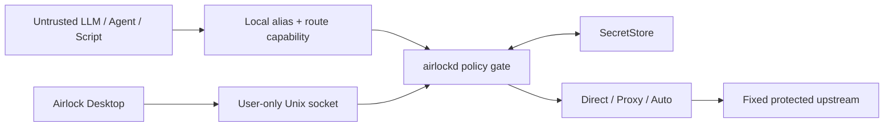

<div align="center">
  
  <h1>Airlock</h1>
  <p><strong>Give agents capabilities. Keep credentials local.</strong></p>
  <p>A native credential-isolation relay for HTTP/Wget, SSH, and LLM API traffic.</p>
  <p>
    <a href="README.md">English</a> |
    <a href="README.zh-CN.md">简体中文</a> |
    <a href="docs/README.md">Documentation</a> |
    <a href="website/en/index.html">Static website</a>
  </p>
  <p>
    <a href="https://github.com/LouisonH/airlock-relay/releases/tag/v0.1.0"></a>
    
    
    
  </p>
</div>

> [!WARNING]
> Airlock v0.1.0 is a technical preview. Route metadata, credentials, and proxy configuration use protected storage, but this release has not completed an independent production security audit.

## Why Airlock?

Untrusted LLMs, agents, scripts, and automation often need to call an API, download a file, or run an SSH command. Giving them the real target URL, upstream account, password, or API key makes that secret available to prompts, logs, tool output, and accidental disclosure.

Airlock gives the caller a fixed local endpoint and a revocable route-specific credential. It keeps the real target and upstream credentials inside a local SecretStore and injects them only after the request passes policy checks.

| The caller receives | Airlock protects |
| --- | --- |
| Local route alias | Real URL, domain, IP, and SSH address |
| Revocable capability token | Upstream password, private key, cookie, and API key |
| Explicitly allowed operation | Other routes and unrestricted network access |
| Sanitized local errors | Upstream identity and credential details |

Airlock is a fixed-route relay, not an open proxy, VPN, or general provider-management platform.

## Core Features

### HTTP / Wget

- Fixed upstream base URL with protected Authorization or custom headers.
- GET/HEAD and query allowlists, path traversal protection, and controlled same-origin redirects.
- Range/206 streaming downloads and response-header sanitization.
- Per-route `Direct`, `Proxy`, or connectivity-safe `Auto` egress.

### SSH

- Terminates the local and upstream SSH sessions separately to isolate identities and credentials.
- Local random capability, custom password, or public-key authentication.
- Protected upstream password or encrypted private-key authentication with strict host-key pinning.
- A user-defined exact command by default; unrestricted non-interactive `exec`
  requires native high-risk confirmation.
- Shell, PTY, SFTP, agent/X11 forwarding, and port forwarding remain denied.
- Optional per-route command audit stored in a user-only `0600` rolling file.

### LLM API

- OpenAI-compatible `/v1/responses` and `/v1/chat/completions` routes.
- Anthropic-compatible `/v1/messages` routes.
- Model allowlist, maximum output tokens, requests per minute, and concurrency limits.
- Random or custom secondary local API key that can rotate independently of the upstream key.
- SSE streaming plus optional in-memory call, input-token, and output-token statistics.
- Usage statistics are disabled by default and never persist prompts or response bodies.

### Native Desktop

- Tauri 2 + React desktop console with a Go `airlockd` sidecar.
- Native protected prompts keep target URLs and credentials outside the WebView.
- System/light/dark themes, three accents, density, refresh cadence, and motion preferences.
- Loopback by default, with explicit native confirmation before private-LAN exposure.
- A password-prompt-free local `0600` file store by default; macOS Keychain is
  available as the stricter, opt-in protection mode.
- Clash-compatible HTTP CONNECT and SOCKS5/SOCKS5H proxy egress.

## How It Works



The desktop GUI never needs an ordinary TCP management port. Closing the window does not have to stop the local relay.

## Install the Technical Preview

The v0.1.0 download supports Apple Silicon Macs running macOS 12 or newer. Get
the DMG and checksum from [GitHub Releases](https://github.com/LouisonH/airlock-relay/releases/tag/v0.1.0),
then follow the [installation guide](docs/installation.md). The package is
ad-hoc signed but is not Developer ID signed or notarized, so read the
Gatekeeper instructions before opening it.

## Development Quick Start

Requirements: Go 1.24+, Node.js 20+, Rust/Cargo, and the Tauri 2 platform dependencies.

```bash
git clone https://github.com/LouisonH/airlock-relay.git
cd airlock-relay/apps/desktop
npm install

# Build the frontend
npm run build

# Launch the native development app and airlockd sidecar
npm run tauri dev
```

Run the core checks from the repository root:

```bash
go test -race ./...
go vet ./...
```

Default data listeners:

- HTTP and LLM: `127.0.0.1:4768`
- SSH: `127.0.0.1:4770`
- Control: current-user-only Unix socket

### Route Examples

```bash
# Fixed HTTP/Wget route
wget --header="Authorization: Bearer <local-token>" \
  http://127.0.0.1:4768/r/release/file.zip

# Isolated SSH route
ssh build@127.0.0.1 -p 4770

# OpenAI-compatible LLM route
export OPENAI_BASE_URL=http://127.0.0.1:4768/r/coding
export OPENAI_API_KEY=<local-api-key>
```

The local tokens and API keys above are revocable capability credentials. They are not upstream secrets.

## Security Model

Airlock reduces secret exposure through fixed targets, least privilege, credential replacement, and sanitized errors. It is not an operating-system sandbox.

- Local administrators, root, processes able to debug Airlock, and attackers controlling the OS are outside the threat model.
- An upstream response or SSH command output can disclose its own environment; a generic relay cannot reliably remove every application-level disclosure.
- Unrestricted SSH `exec` is close to remote code execution as the upstream account. Use a dedicated least-privilege account.
- A capability credential limits access to one route but should still be rotated if exposed.
- Do not place passwords or tokens in commands when command auditing is enabled.

See the [security policy](SECURITY.md), [implementation and threat-model plan](.claude/plan/airlock-1.md), and [desktop UI security specification](docs/ui-spec.md) for details.

## Project Layout

```text
apps/desktop       Tauri 2 + React native desktop app
cmd/airlockd       Go daemon entry point
internal/control   Protected local control protocol
internal/httpgw    HTTP/Wget and LLM gateway
internal/sshgw     Dual-session SSH gateway
internal/routes    Route policy and metadata
internal/secrets   Keychain and local SecretStore backends
website            Bilingual static documentation website
```

## Current Roadmap

- Sidecar crash recovery and metadata migration tooling.
- TTL and one-time capabilities.
- SSH/HTTP capability rotation and per-connection approval.
- Sanitized HTTP/LLM activity events and persistent quota/cost reporting.
- Windows and Linux SecretStore and service integration.
- Release signing, CI secret scanning, and a complete security review.

## Documentation

Start with the [documentation index](docs/README.md), [release notes](docs/releases/v0.1.0.md), [changelog](CHANGELOG.md), or open the [static website](website/en/index.html) locally. The website supports English and Simplified Chinese, light/dark appearance, protocol examples, and narrow-screen layouts without requiring a Web management service. GitHub Pages is not enabled while this repository remains private.

## Developer

Airlock is designed and developed by [**LouisonH**](https://0o0.site), with AI-assisted engineering and verification using **GPT-5.6 Sol**. Developer profile: [github.com/LouisonH](https://github.com/LouisonH).
