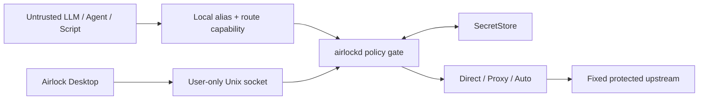

<div align="center">
  
  <h1>Airlock</h1>
  <p><strong>Give agents capabilities. Keep credentials local.</strong></p>
  <p>A native credential-isolation relay for HTTP/Wget, SSH, and LLM API traffic.</p>
  <p>
    <a href="README.md">English</a> |
    <a href="README.zh-CN.md">简体中文</a> |
    <a href="README.ja.md">日本語</a> |
    <a href="docs/README.md">Documentation</a> |
    <a href="https://louisonh.github.io/airlock-relay/">Static website</a>
  </p>
  <p>
    <a href="https://louisonh.github.io/airlock-relay/"></a>
    <a href="https://github.com/LouisonH/airlock-relay/releases/tag/v0.1.7"></a>
    
    
    
  </p>
</div>

> [!WARNING]
> Airlock v0.1.7 is a technical preview that has completed a maintainer-run production-readiness security audit. It has not completed an independent third-party audit, Apple Developer ID signing, or notarization. Read the [audit record](docs/security-audit-2026-07-31.md) before production use.

## Why Airlock?

Untrusted LLMs, agents, scripts, and automation often need to call an API, download a file, or run an SSH command. Giving them the real target URL, upstream account, password, or API key makes that secret available to prompts, logs, tool output, and accidental disclosure.

Airlock gives the caller a fixed local endpoint and a revocable route-specific credential. It keeps the real target and upstream credentials inside a local SecretStore and injects them only after the request passes policy checks.

| The caller receives | Airlock protects |
| --- | --- |
| Local route alias | Real URL, domain, IP, and SSH address |
| Revocable capability token | Upstream password, private key, cookie, and API key |
| Explicitly allowed operation | Other routes and unrestricted network access |
| Sanitized local errors | Upstream identity and credential details |

Airlock is a fixed-route relay, not an open proxy, VPN, or general provider-management platform.

## Core Features

### HTTP / Wget

- Fixed upstream base URL with protected Authorization or custom headers.
- GET/HEAD and query allowlists, path traversal protection, and controlled same-origin redirects.
- Range/206 streaming downloads and response-header sanitization.
- Per-route `Direct`, `Proxy`, or connectivity-safe `Auto` egress.

### SSH

- Terminates the local and upstream SSH sessions separately to isolate identities and credentials.
- Local random capability, custom password, or public-key authentication.
- Protected upstream password or encrypted private-key authentication with strict host-key pinning.
- A user-defined exact command by default; unrestricted non-interactive `exec`
  requires explicit high-risk acknowledgement inside Airlock.
- Multiple routes may share one upstream address; distinct local usernames select
  independent upstream accounts and protected credentials.
- Interactive shells are disabled by default and can be enabled per route (`allow_interactive_shell: true`, which requires `allow_all_commands: true`). With the switch on, PuTTY and `ssh` clients enter the upstream shell directly while Airlock still injects the stored upstream credentials; this covers `su` and other interactive workflows. Agent/X11 and port forwarding remain denied, and PTY metadata is forwarded only when the interactive-shell switch is enabled. SFTP is disabled by default and can be explicitly enabled per route for modern `scp`/SFTP clients; it remains a separate high-risk file access permission.
- Optional per-route command audit stored in a user-only `0600` rolling file.

### LLM API

- OpenAI-compatible `/v1/responses` and `/v1/chat/completions` routes.
- Anthropic-compatible `/v1/messages` routes.
- Model allowlist, maximum output tokens, requests per minute, and concurrency limits.
- Random or custom secondary local API key that can rotate independently of the upstream key.
- SSE streaming plus optional in-memory call, input-token, and output-token statistics.
- Usage statistics are disabled by default and never persist prompts or response bodies.

### Native Desktop

- Tauri 2 + React desktop console with a Go `airlockd` sidecar.
- SSH credentials, Host Key verification, and one-time local access details stay
  in the Airlock wizard and are sent once over local Tauri IPC to `airlockd`.
- HTTP, LLM, and proxy secrets continue to use protected native prompts.
- System/light/dark themes, three accents, density, refresh cadence, and motion preferences.
- Loopback by default, with explicit native confirmation before private-LAN exposure.
- A password-prompt-free local `0600` file store by default; macOS Keychain is
  available as the stricter, opt-in protection mode.
- Clash-compatible HTTP CONNECT and SOCKS5/SOCKS5H proxy egress.

### Server Core and Operations

- `airlockd --mode server` runs the fixed-route core without Tauri or a desktop session.
- The `airlock` Unix-socket CLI administers fixed routes, SSH mappings, health checks, and protected proxy egress without placing upstream secrets in command arguments.
- An optional separately authenticated, loopback-only Web UI exposes sanitized status and safe route operations; use an SSH tunnel for remote administration.
- See the [server deployment and CLI guide](docs/server-deployment.md) for service accounts, systemd, protected JSON specifications, Wget, SSH, LLM, and Clash examples.

## How It Works



The desktop GUI never needs an ordinary TCP management port. Closing the window does not have to stop the local relay.

## Install the Technical Preview

The npm installer supports Apple Silicon and Intel Macs (macOS 12 or newer),
Windows x64/x86/arm64, and Linux x64/arm64. Install the verified app with:

```bash
npm install -g airlock-relay && airlock-installer install --open
```

Every platform downloads its pinned, SHA-256-verified release asset; checksum
mismatches fail closed. Windows uses the NSIS installer (an elevation prompt may
appear), Linux installs an AppImage to `~/.local/bin`, and macOS mounts the
verified DMG. Linux artifacts are additionally GPG-signed with the `Airlock
Release Signing` key; the public key and detached signatures ship with the
release. 64-bit Raspberry Pi OS installs the arm64 AppImage directly, and
32-bit armv7 users can build the desktop bundle on the Pi with
`scripts/build-armv7-desktop.sh`. Alternatively, get the artifacts and checksums from
[GitHub Releases](https://github.com/LouisonH/airlock-relay/releases/tag/v0.1.7),
then follow the [installation guide](docs/installation.md). The macOS package is
ad-hoc signed but is not Developer ID signed or notarized, so read the
Gatekeeper instructions before opening it.

The npm diagnostic CLI also installs without side effects on Windows x64/x86/ARM64
and Linux x64/ARM64. Run `airlock-installer status --json` or
`airlock-installer platform --json` to inspect the current contract. Those
targets are CI previews, not verified public installers: `install` fails closed
and never downloads an unverified CI artifact. Linux ARMv7 and macOS x64 remain
planned.

## Development Quick Start

Requirements: Go 1.25+, Node.js 20+, Rust/Cargo, and the Tauri 2 platform dependencies.

```bash
git clone https://github.com/LouisonH/airlock-relay.git
cd airlock-relay/apps/desktop
npm install

# Build the frontend
npm run build

# Launch the native development app and airlockd sidecar
npm run tauri dev
```

Run the core checks from the repository root:

```bash
go test -race ./...
go vet ./...
```

Default data listeners:

- HTTP and LLM: `127.0.0.1:4768`
- SSH: `127.0.0.1:4770`
- Control: current-user-only Unix socket

### Route Examples

```bash
# Fixed HTTP/Wget route
wget --header="Authorization: Bearer <local-token>" \
  http://127.0.0.1:4768/r/release/file.zip

# Isolated SSH route
ssh build@127.0.0.1 -p 4770

# OpenAI-compatible LLM route
export OPENAI_BASE_URL=http://127.0.0.1:4768/r/coding
export OPENAI_API_KEY=<local-api-key>
```

The local tokens and API keys above are revocable capability credentials. They are not upstream secrets.

## Security Model

Airlock reduces secret exposure through fixed targets, least privilege, credential replacement, and sanitized errors. It is not an operating-system sandbox.

- Local administrators, root, processes able to debug Airlock, and attackers controlling the OS are outside the threat model.
- An upstream response or SSH command output can disclose its own environment; a generic relay cannot reliably remove every application-level disclosure.
- Unrestricted SSH `exec` is close to remote code execution as the upstream account. Use a dedicated least-privilege account.
- A capability credential limits access to one route but should still be rotated if exposed.
- Do not place passwords or tokens in commands when command auditing is enabled.

See the [security policy](SECURITY.md), [implementation and threat-model plan](.claude/plan/airlock-1.md), and [desktop UI security specification](docs/ui-spec.md) for details.

## Project Layout

```text
apps/desktop       Tauri 2 + React native desktop app
cmd/airlockd       Go daemon entry point
cmd/airlock        Server operations CLI entry point
internal/control   Protected local control protocol
internal/httpgw    HTTP/Wget and LLM gateway
internal/sshgw     Dual-session SSH gateway
internal/routes    Route policy and metadata
internal/secrets   Keychain and local SecretStore backends
website            Bilingual static documentation website
deploy/systemd     Server service examples
```

## Current Roadmap

- Sidecar crash recovery and metadata migration tooling.
- TTL and one-time capabilities.
- SSH/HTTP capability rotation and per-connection approval.
- Sanitized HTTP/LLM activity events and persistent quota/cost reporting.
- Windows and Linux desktop runtime acceptance, signing, and service integration.
- [Cross-platform artifact and security adaptation](docs/cross-platform.md).
- Release signing, CI secret scanning, and a complete security review.

## Documentation

Start with the [documentation index](docs/README.md), [v0.1.7 release notes](docs/releases/v0.1.7.md), [security audit](docs/security-audit-2026-07-31.md), [changelog](CHANGELOG.md), or visit the [Airlock documentation site](https://louisonh.github.io/airlock-relay/). The site supports English, Simplified Chinese, and Japanese, light/dark appearance, protocol examples, and narrow-screen layouts without requiring a Web management service.

## License

Copyright 2026 LouisonH. Airlock is licensed under the [Apache License 2.0](LICENSE).

## Developer

Airlock is designed and developed by [**LouisonH**](https://0o0.site), a developer
affiliated with **South China University of Technology (SCUT)**, with AI-assisted
engineering and verification using **GPT-5.6 Sol**. Airlock is an independent
personal project and does not represent an official SCUT project, position, or
endorsement. Developer profile: [github.com/LouisonH](https://github.com/LouisonH).
