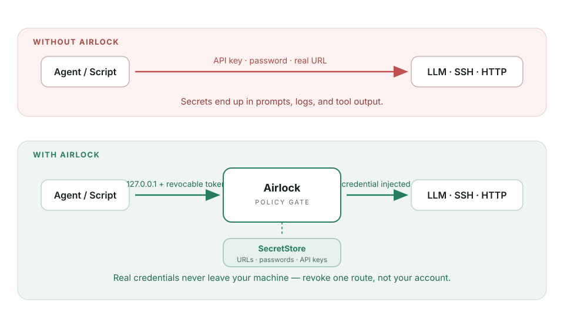
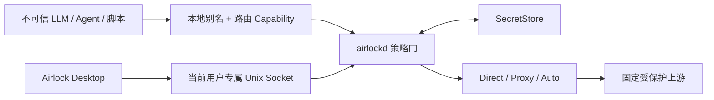

<div align="center">
  
  <h1>Airlock</h1>
  <p><strong>把能力交给 Agent，把凭据留在本机。</strong></p>
  <p>你的 AI Agent、脚本和自动化任务可以拿到完成任务所需的访问权——但永远看不到真实 URL、密码或 API Key。</p>
  <p>
    <a href="README.md">English</a> |
    <a href="README.zh-CN.md">简体中文</a> |
    <a href="README.ja.md">日本語</a> |
    <a href="docs/README.md">文档索引</a> |
    <a href="https://louisonh.github.io/airlock-relay/">静态说明网页</a>
  </p>
  <p>
    <a href="https://louisonh.github.io/airlock-relay/"></a>
    <a href="https://github.com/LouisonH/airlock-relay/releases/tag/v0.1.7"></a>
    
    
    
  </p>
</div>

> [!WARNING]
> Airlock v0.1.7 是技术预览版，已完成维护者执行的生产就绪安全审计；它尚未完成独立第三方审计、Developer ID 签名或 Apple 公证。生产使用前请阅读[审计记录](docs/security-audit-2026-07-31.md)。

## 为什么需要 Airlock？

<p align="center">
  
</p>

不可信的 LLM、Agent、脚本和自动化任务经常需要调用 API、下载文件或执行 SSH 命令。如果直接把真实目标 URL、上游账户、密码或 API Key 交给它们，这些 Secret 便可能进入提示词、日志、工具输出或被意外泄露。

Airlock 只给调用者一个固定本地入口和可撤销的路由凭据。真实目标与上游凭据保存在本地 SecretStore 中，只有当请求通过策略检查后才会被注入。

| 调用者获得 | Airlock 保护 |
| --- | --- |
| 本地路由别名 | 真实 URL、域名、IP 和 SSH 地址 |
| 可撤销 Capability Token | 上游密码、私钥、Cookie 和 API Key |
| 明确允许的操作 | 其他路由和无限制网络访问 |
| 脱敏的本地错误 | 上游身份与凭据细节 |

Airlock 是固定路由转发器，不是开放代理、VPN 或通用供应商管理平台。

## 核心功能

### HTTP / Wget

- 固定上游基址，Authorization 或自定义 Header 受保护。
- GET/HEAD 和 Query 白名单、路径逃逸防护与受控同源重定向。
- Range/206 流式下载与响应 Header 脱敏。
- 每路由 `Direct`、`Proxy` 或连通性安全的 `Auto` 出口。

### SSH

- 分别终止本地和上游 SSH 会话，实现身份与凭据隔离。
- 本地随机 Capability、自定义密码或公钥认证。
- 受保护的上游密码或加密私钥认证，并严格固定 Host Key。
- 默认只允许用户自定义的一条精确命令；所有非交互 `exec` 需要在 Airlock 内明确确认高风险。
- 多条路由可以指向同一个上游地址；不同本地用户名选择彼此独立的上游账号与受保护凭据。
- 交互式 Shell 默认关闭，可按路由开启（`allow_interactive_shell: true`，要求同时开启 `allow_all_commands: true`）。开启后，PuTTY 与 `ssh` 客户端会直接进入上游 Shell，Airlock 仍注入存储的上游凭据，可覆盖 `su` 等交互式工作流。Agent/X11 Forwarding 与端口转发始终拒绝；只有开启交互式 Shell 开关时才会向上游转发 PTY 元数据。SFTP 默认关闭，可为现代 `scp`/SFTP 客户端按路由显式启用，属于独立的高风险文件访问权限。
- 可选的每路由命令审计，保存在当前用户专属的 `0600` 滚动文件中。

### LLM API

- OpenAI-compatible `/v1/responses` 和 `/v1/chat/completions` 路由。
- Anthropic-compatible `/v1/messages` 路由。
- 模型白名单、最大输出 Token、每分钟请求数和并发上限。
- 随机或自定义本地二次 API Key，可与上游 Key 独立轮换。
- SSE 流式转发与可选的内存调用、输入 Token 和输出 Token 统计。
- 统计默认关闭，不持久化提示词或响应正文。

### 原生桌面端

- Tauri 2 + React 桌面控制台与 Go `airlockd` sidecar。
- SSH 凭据、Host Key 核对和一次性本地访问信息集成在 Airlock 向导内，并通过本机
  Tauri IPC 单次发送给 `airlockd`。
- HTTP、LLM 与代理 Secret 仍使用受保护的原生输入窗口。
- 系统/浅色/深色主题、三种配色、密度、刷新频率与动效偏好。
- 默认仅 loopback，开放私有局域网前需要原生确认。
- 默认使用无需启动密码弹窗的本地 `0600` 文件；macOS Keychain 作为更严格的可选保护模式。
- 兼容 Clash 的 HTTP CONNECT 和 SOCKS5/SOCKS5H 代理出口。

### Server Core 与运维

- `airlockd --mode server` 不需要 Tauri 或桌面会话，即可运行固定路由核心。
- `airlock` Unix Socket CLI 可管理固定路由、SSH 映射、健康检查与受保护代理出口，不会把上游 Secret 放进命令行参数。
- 可选 Web UI 使用独立令牌且只监听 loopback；它只展示脱敏状态与安全路由操作，远程运维请通过 SSH 隧道。
- 完整的服务账户、systemd、受保护 JSON、Wget、SSH、LLM 与 Clash 示例见 [Server Core 部署与命令行](docs/server-deployment.zh-CN.md)。

## 工作方式



桌面 GUI 不需要普通 TCP 管理端口。关闭窗口后，本地转发服务仍可继续运行。

## 安装技术预览版

v0.1.7 的 npm 安装器支持 Apple Silicon 与 Intel Mac（macOS 12 或更高版本）、
Windows x64/x86/arm64 与 Linux x64/arm64。可用以下命令安装已核验的应用：

```bash
npm install -g airlock-relay && airlock-installer install --open
```

也可从 [GitHub Releases](https://github.com/LouisonH/airlock-relay/releases/tag/v0.1.7)
下载 DMG 和校验文件，再按照[安装指南](docs/installation.zh-CN.md)操作。安装包已进行
ad-hoc 签名，但没有 Developer ID 签名与 Apple 公证，请先阅读 Gatekeeper 说明。

各平台都会下载固定校验和的发布产物，校验失败即拒绝安装：Windows 使用 NSIS
安装器（可能出现提权提示），Linux 安装 AppImage 到 `~/.local/bin`，macOS 挂载
已核验 DMG。Linux 产物还使用 `Airlock Release Signing` 密钥做 GPG 签名，公钥与
分离签名随 Release 发布。64 位树莓派系统可直接安装 arm64 AppImage；32 位
armv7 用户可在树莓派上运行 `scripts/build-armv7-desktop.sh` 构建桌面包。
npm 诊断 CLI 也可在 Windows x64/x86/ARM64 与 Linux x64/ARM64 无副作用安装。运行
`airlock-installer status --json` 或 `airlock-installer platform --json` 查看当前平台契约。
这些目标属于 CI 预览，不是经过公开校验的安装器：`install` 会失败关闭，绝不会下载未验证
CI 产物。Linux ARMv7 与 macOS x64 仍处于计划阶段。

## 开发环境快速开始

需要 Go 1.25+、Node.js 20+、Rust/Cargo 和 Tauri 2 平台依赖。

```bash
git clone https://github.com/LouisonH/airlock-relay.git
cd airlock-relay/apps/desktop
npm install

# 构建前端
npm run build

# 启动原生开发应用与 airlockd sidecar
npm run tauri dev
```

在仓库根目录运行核心检查：

```bash
go test -race ./...
go vet ./...
```

默认数据入口：

- HTTP 与 LLM：`127.0.0.1:4768`
- SSH：`127.0.0.1:4770`
- 控制面：当前用户专属 Unix Socket

### 路由示例

```bash
# 固定 HTTP/Wget 路由
wget --header="Authorization: Bearer <local-token>" \
  http://127.0.0.1:4768/r/release/file.zip

# 隔离 SSH 路由
ssh build@127.0.0.1 -p 4770

# OpenAI-compatible LLM 路由
export OPENAI_BASE_URL=http://127.0.0.1:4768/r/coding
export OPENAI_API_KEY=<local-api-key>
```

上述本地 Token 和 API Key 是可撤销的能力凭据，不是上游 Secret。

## 安全边界

Airlock 通过固定目标、最小权限、凭据替换与脱敏错误减少 Secret 暴露，但它不是操作系统级沙箱。

- 本机管理员、root、可调试 Airlock 进程或已控制操作系统的攻击者不在威胁模型内。
- 上游响应或 SSH 命令输出可能主动泄露自身环境；通用转发器无法可靠移除所有应用层泄露。
- 不受限 SSH `exec` 接近上游账户的远程代码执行权限，应使用专用低权限账户。
- Capability 凭据会把访问限制在单条路由，但泄露后仍应轮换。
- 开启命令审计后，不要把密码或 Token 放入命令参数。

详细信息见[安全策略](SECURITY.md#简体中文)、[实施与威胁模型计划](.claude/plan/airlock-1.md)和[桌面 UI 安全规范](docs/ui-spec.md)。

## 项目结构

```text
apps/desktop       Tauri 2 + React 原生桌面应用
cmd/airlockd       Go 守护进程入口
cmd/airlock        Server 运维 CLI 入口
internal/control   受保护本地控制协议
internal/httpgw    HTTP/Wget 与 LLM 网关
internal/sshgw     双会话 SSH 网关
internal/routes    路由策略与元数据
internal/secrets   Keychain 与本地 SecretStore 后端
website            双语静态说明网站
deploy/systemd     服务端 systemd 示例
```

## 当前路线图

- Sidecar 异常恢复与元数据迁移工具。
- TTL 和一次性 Capability。
- SSH/HTTP Capability 轮换与每次连接确认。
- 脱敏 HTTP/LLM 活动事件与可持久额度/费用统计。
- Windows 和 Linux SecretStore 与服务集成。
- [跨平台产物与安全适配方案](docs/cross-platform.zh-CN.md)。
- 发布签名、CI Secret 扫描与完整安全审查。

## 文档

可从[文档索引](docs/README.md)、[v0.1.7 发布说明](docs/releases/v0.1.7.zh-CN.md)、[审计记录](docs/security-audit-2026-07-31.md)与[更新日志](CHANGELOG.md)开始，也可访问 [Airlock 文档网站](https://louisonh.github.io/airlock-relay/)。网页支持中文、英文与日文、深浅外观、协议示例和窄屏布局，不需要启动 Web 管理服务。

## 许可证

Copyright 2026 LouisonH。Airlock 使用 [Apache License 2.0](LICENSE) 开源协议。

## 开发者

Airlock 由华南理工大学（SCUT）相关开发者 [**LouisonH**](https://0o0.site) 进行产品设计与核心开发，并使用 **GPT-5.6 Sol** 辅助工程实现与验证。本项目为独立个人项目，不代表华南理工大学的官方项目、立场或背书。GitHub：[github.com/LouisonH](https://github.com/LouisonH)。
